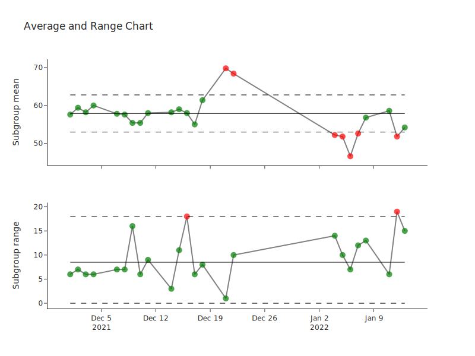

Introduction
============
spc-charts is for the creation of Plotly charts for use in Statistical Process Control.

Shewart Average and Range Chart
-------------------------------

| Creates an interactive Average and Range chart using Plotly.

* Subgroups are classed as out of control if they are greater than the
  upper control limit or less than the lower control limit.
* Each subgroup can be labelled and the labels will be shown on the
  chart when the mouse pointer is near the marker.
* The control limits can be calculated from a set of data and the chart
  plotted.
* New data can be plotted using the calculated control limits.
* The chart can be saved as PNG, JPEG, WebP, SVG or PDF.
* The control limits can be saved to JSON, and loaded from JSON.
* The control limits can be set and retrieved as a dictionary.
* The subgroup labels, averages, ranges and status (in or out of
  control) can be retrieved as a pandas Dataframe.

For an example of usage see:
`XbarR_example.ipynb <https://github.com/joolian/plotly_spc_charts/blob/main/examples/XbarR/XbarR_example.ipynb>`__

Calculation of control limits
~~~~~~~~~~~~~~~~~~~~~~~~~~~~~

Calculations use the method given in: *Wheeler, D.J. and Chambers, D.S.
(1992) Understanding statistical process control. SPC Press,
Incorporated, p. 44.*

   :math:`UCL_{\bar{X}} = \bar{\bar{X}} + A_{2}\bar{R}`

   :math:`LCL_{\bar{X}} = \bar{\bar{X}} - A_{2}\bar{R}`

   :math:`CL_{\bar{X}} = \bar{\bar{X}}`

   :math:`UCL_{R} = D_{4}\bar{R}`

   :math:`CL_{R} = \bar{R}`

   :math:`LCL_{R} = D_{3}\bar{R}`

Where:

   | :math:`\bar{\bar{X}}` is the average of all the values in the subgroups.
   | :math:`\bar{R}` is the average of the subgroup ranges.
   | :math:`A_{2}` is the value of the constant corresponding to the subgroup size.
   | :math:`D_{3}` is the value of the constant corresponding to the subgroup size.
   | :math:`D_{4}` is the value of the constant corresponding to the subgroup size.

Shewart Individual and Moving Range Chart
-----------------------------------------

Creates an interactive individual Moving Range chart using Plotly.

* Individual values and moving ranges are classed as out of control if
  they are greater than the upper control limit or less than the lower
  control limit.
* Each value can be labelled and the labels will be shown on the chart
  when the mouse pointer is near the marker.
* The control limits can be calculated from a set of data and the chart
  plotted.
* New data can be plotted using the calculated control limits.
* The chart can be saved as PNG, JPEG, WebP, SVG and PDF.
* The control limits can be saved to JSON, and loaded from JSON.
* The control limits can be set and retrieved as a dictionary.
* The labels, individual values, moving ranges and status (in or out of
  control) can be retrieved as a pandas Dataframe.

For an example of usage see:
`IndividualMR_example.ipynb <https://github.com/joolian/plotly_spc_charts/blob/main/examples/IndividualMR/IndividualMR_example.ipynb>`__

.. _calculation-of-control-limits-1:

Calculation of control limits
~~~~~~~~~~~~~~~~~~~~~~~~~~~~~

Calculations use the method given in: *Wheeler, D.J. and Chambers, D.S.
(1992) Understanding statistical process control. SPC Press,
Incorporated, pp. 48-49.*

   :math:`UNPL_{X} = \bar{X} + \displaystyle\frac{3\bar{mR}}{d_{2}}`

   :math:`LNPL_{X} = \bar{\bar{X}} - \displaystyle\frac{3\bar{mR}}{d_{2}}`

   :math:`CL_{X} = \bar{X}`

   :math:`UCL_{R} = D_{4}\bar{mR}`

   :math:`CL_{R} = \bar{mR}`

Where:

   :math:`\bar{X}` is the average of the individual values.

   :math:`\bar{mR}` is the average of the moving ranges.

   :math:`d_{2}` is the value of the constant corresponding to n=2.

   :math:`D_{4}` is the value of the constant corresponding to n=2.

Run Chart
---------
Creates an interactive run chart using Plotly.

* Each value can be labelled and the labels will be shown on the chart
  when the mouse pointer is near the marker.
* The chart can be saved as PNG, JPEG, WebP, SVG and PDF.
* The value of the median can be retrieved.

For an example of usage see:
`Run_example.ipynb <https://github.com/joolian/plotly_spc_charts/blob/main/examples/Run/Run_example.ipynb>`__

Constants
---------

| Constants for the computing of control limits are listed in
  `factor_values_for_shewart_charts.csv <https://github.com/joolian/plotly_spc_charts/blob/main/spc_charts/factor_values_for_shewart_charts.csv>`__.
| Values where extracted from: `A Note on the Factor Values of Three
  Common Shewhart Variables Control Charts. Henry H. Bi. 2015.
  Communications in Statistics - Theory and Methods (0361-0926). 44(13):
  2655-2673.
  DOI:10.1080/03610926.2014.968732 <https://www.researchgate.net/publication/275236350_A_Note_on_the_Factor_Values_of_Three_Common_Shewhart_Variables_Control_Charts_Henry_H_Bi_2015_Communications_in_Statistics_-_Theory_and_Methods_0361-0926_4413_2655-2673_httpdxdoiorg1010800361092620149>`__\

TODO
----

| implement Western Electric rules.
| See: \ `Western Electric Company, Statistical Quality Control
  Handbook., Indianapolis, Indiana: Western Electric
  Co <https://www.westernelectric.com/library#technical>`__\

Add np-chart, p-chart, c-chart and u-chart, EWMA-chart, CUSUM-chart,
pareto-chart and multi-variate charts.